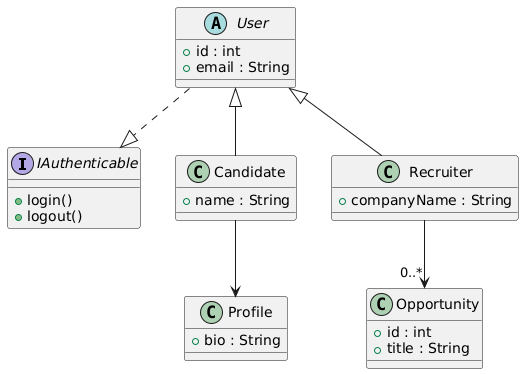

## Ktami Lamiae
## Nom de projet :  Application de Matching Compétences-Opportunités avec IA
## Description du diagramme UML

Ce diagramme représente une application simple de matching compétences ↔ opportunités, utilisant héritage et une interface.

## Interface
IAuthenticable : définit deux méthodes, login() et logout(), pour tous les utilisateurs du système.

## Classe abstraite
User : classe de base pour tous les utilisateurs, avec les attributs id et email.

## Héritage
Candidate hérite de User et possède un attribut name.
Chaque candidat est lié à un Profile contenant un résumé ou une biographie.
Recruiter hérite de User et possède un attribut companyName.
Chaque recruteur peut publier plusieurs Opportunity (offres d’emploi).

## Relations
Candidate → Profile : chaque candidat possède un profil.
Recruiter → Opportunity : chaque recruteur peut publier plusieurs opportunités.

## Description de l'application
L’application met en relation les compétences des candidats avec les opportunités des recruteurs. Chaque candidat crée un profil avec ses compétences et expériences, tandis que les recruteurs publient des offres en précisant les compétences requises. Un moteur de matching calcule un score de correspondance pour recommander les candidats les mieux adaptés à chaque offre. L’application permet également de gérer les candidatures et de consulter les recommandations, tout en restant simple et extensible pour intégrer ultérieurement des fonctionnalités avancées comme l’IA, les filtres ou les analyses statistiques.
